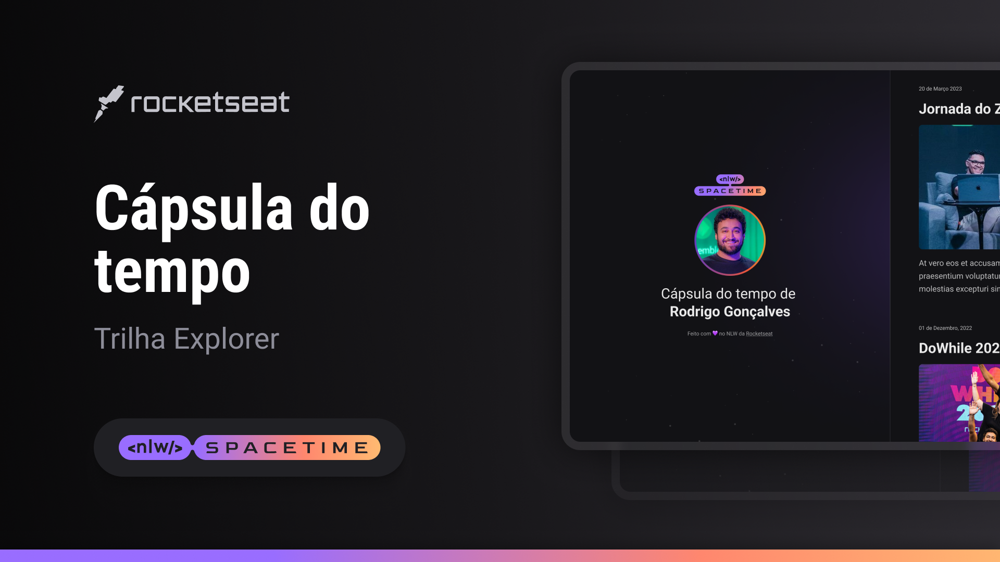

## The Project 
This is a web-responsive project created for the "Next Level Week" event of Rocketseat Technology School.

## Technologies
The technologies used were:
- HTML;
- CSS;
- Git and GitHub.

## Layout
You can see the project's layout at [link](https://www.figma.com/file/2XgNjvyDEN42rL8xinjqXw/C%C3%A1psula-do-tempo-%E2%80%A2-Trilha-Explorer-(Community)?type=design&node-id=306%3A84&t=05a1yyYkylg1dlrx-1). 
A [Figma](https://www.figma.com) account is required.